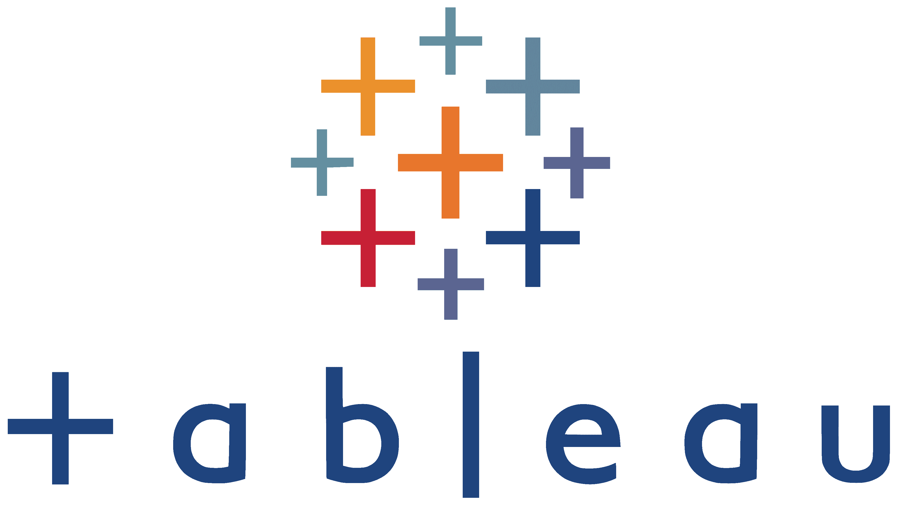
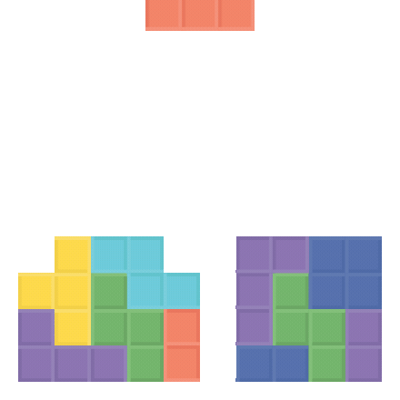

  

  <h3>🌐 Do Visit: <a href="https://soham-mane.vercel.app" target="_blank">soham-mane.vercel.app</a></h3>

  

## **Hi there, I'm Soham Mane** 

I'm a **Data Analyst and Data Engineer** passionate about solving real-world problems using data. I design and build **scalable data pipelines**, **ML models**, and **automated analytics solutions** across cloud platforms like **AWS**, **GCP**, and **Azure**. My goal is to create intelligent systems that are both impactful and efficient.

🎓 Graduated with a **Master’s in Data Analytics (Applied Machine Intelligence)** from Northeastern University, Boston, USA. Feel free to connect with me on .
__________________________________________________________________________________________________________________ 

<h3 align="left">📦 My Published Packages </h3>
🔹 <a href="https://pypi.org/project/csvdiffgpt/" target="_blank"><b>csvdiffgpt</b></a>

__________________________________________________________________________________________________________________
<h3 align="left">💼 Portfolio Projects</h3>

🔹 [**OTT Content Analytics Pipeline**](https://github.com/SohamMane812/OTT-Content-Analytics-Recommendation-Engine)  
🔹 [**Hadoop EcoSystem Data Pipeline**](https://github.com/SohamMane812/HDFS-Spark-Kafka-Pipeline)  
🔹 [**LLM-Powered Healthcare Chatbot**](https://github.com/SohamMane812/Agentic_Healthcare_Chatbot)  
🔹 [**Wholesaler Shipping Optimization at Brewery**](https://github.com/SohamMane812/Optimization-of-Wholesaler-Shipping-at-Brewery)  
🔹 [**Google Data Warehousing (GCP)**](https://github.com/SohamMane812/GCP-Data-Warehousing)  
🔹 [**AWS Serverless Loan ETL Pipeline**](https://github.com/SohamMane812/AWS-Data-Warehousing)  
🔹 [**Automated YouTube Analytics Pipeline (AWS)**](https://github.com/SohamMane812/Automated-Data-Pipeline-for-YouTube-Analytics-Using-AWS)

__________________________________________________________________________________________________________________
<h3 align="left">🛠️ Tech Stack</h3>

<h4 align="left">📌 Languages & Frameworks</h4>

 
 
 
 
 

<h4 align="left">🔧 Tools & Platforms</h4>

 
 
 
 
 </a>
 </a>
 
 
 
 

  

<h4 align="left">🧠 GenAI</h4>

  
  
  

## ⚡ Fun fact:
- When I’m not wrangling data or deploying pipelines, I’m probably watching anime, walking through Boston, or lifting weights at the gym 💪

  

<h3 align="left">Connect with me:</h3>

  

    
  

